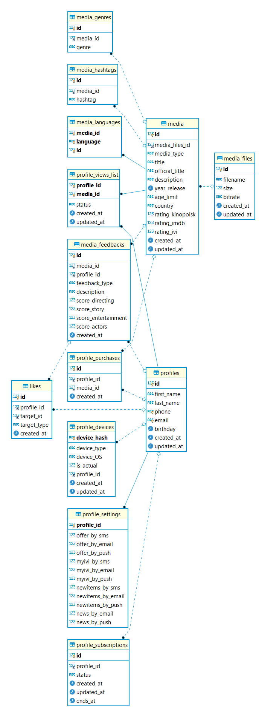

# db_mysql_prototype

Prototype of [ivi.ru](https://www.ivi.ru/)  MySQL DB.

## Tables

* profiles
* profile_settings
* profile_subscriptions
* profile_purchases
* profile_devices
* profile_views_list
* media
* media_files
* media_feedbacks
* media_languages
* media_hashtags
* media_genres
* likes

## DB Schema



## How to restore DB

Restore dump from `step_3-5-dump-ivi_db-202008031104.sql`

```bash
mysql -u [user] -p ivi_db < step_3-5-dump-ivi_db-202008031104.sql
```

Test queries are located in `step_4-requests.sql`
